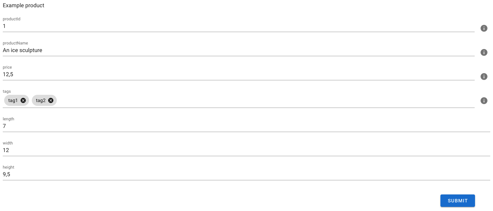

# Vue JSON list generator

  
&nbsp;

## Required
* Vue
* Vuetify
  
  &nbsp;

## Installation
```shell
npm i vue-json-listgenerator
```
&nbsp;  

## Usage
```js
import { VueDataListGenerator, VueSchemaListGenerator } from 'vue-json-listgenerator'; 
import schema from './schema' //This is a JSON-file that contains a JSON-schema

data: () => ({
	exampleData: {
    "productId": 1,
    "productName": "An ice sculpture",
    "price": 12.50,
    "tags": [ "cold", "ice" ],
    "dimensions": {
      "length": 7.0,
      "width": 12.0,
      "height": 9.5
    },
    "warehouseLocation": {
      "latitude": -78.75,
      "longitude": 20.4
    }
  }
})
```


```html 
<VueSchemaListGenerato :schema="schema"> <!-- schema is a JSON-file that contains JSON-schema -->
<VueDataListGenerator :schema="schema" :data="exampleData"/> <!-- This component takes data as prop which is an object -->
```